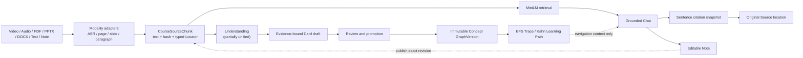

<h1 align="center">Citefold</h1>

Citefold is a local-first workspace for studying course videos and documents.
It normalizes source material into one evidence model, supports multi-turn Chat
with sentence-level citations, and provides Notes and a versioned Concept Graph.

[Roadmap](docs/roadmap.md) | [Architecture decisions](docs/decisions/) |
[Engineering log](docs/productization-log.md) |
[Learning notes](docs/project-mastery-plan.md)

> **Status:** The core local workflow is implemented, but the project is not
> release-complete. Some package and UI identifiers still use the legacy
> **Video Course Cards** name. The current supported entry point is the browser
> frontend with a local backend; there is no supported desktop installer.

## Core data model

- A video, PDF, slide deck, document, or published Note is a `CourseSource`.
- A `CourseSourceChunk` with a typed `Locator` is the canonical evidence unit.
- Cards, Concepts, Relations, summaries, and graph paths are derived data.
- Chat citations are server-owned snapshots that resolve to a video timestamp,
  PDF page, slide, or document paragraph.

## Product loop

1. Import local videos, audio, PDFs, PPTX, DOCX, or text into **Sources**.
2. Ask multi-turn questions in **Chat** and inspect sentence-level citations.
3. Save useful answers as editable **Notes**; publish an exact Note revision as
   a new Source when it should participate in retrieval.
4. Use **Studio** to study Cards, review with FSRS, and inspect published
   Concept paths with evidence on every node and edge.

## What works today

| Area | Implemented | Current boundary |
| --- | --- | --- |
| Sources | One `CourseSource` / `CourseSourceChunk` / typed `Locator` model for video transcripts, audio, PDF pages, PPT slides, DOCX paragraphs, text, and published Notes | Automatic Understanding is not yet one uniform source-to-Card pipeline for every modality |
| Grounded Chat | Source-scoped conversations, bounded multi-turn history, MiniLM retrieval, Ollama-compatible generation, strict structured output, refusal, and durable sentence citations | Local `qwen3:4b` has not yet passed a model-quality or strict-output reliability gate |
| Graph-guided Chat | An explicit two-Concept question may attach the exact path from the active published GraphVersion; the route is persisted and shown with support basis and traversal direction | Exact name/alias matching only; the graph cannot add evidence or replace Source retrieval |
| Notes | Free notes, save-answer-to-note with immutable citation provenance, revision-safe editing, and explicit Note-to-Source publication | Local single-user workflow; no collaboration or cloud sync |
| Studio | Timestamped Cards, Study documents, FSRS Review, Course Map, Concept Graph Overview/Local/Trace/Learning views, evidence inspection, Draft Review, and compare-and-swap graph publication | No automatic Source-to-Concept promotion, human-reviewed gold graph, or Obsidian-scale overview yet |
| Reliability | Persisted task progress, cancel/retry/restart recovery, autosaved drafts, conflict states, Trash/Undo, and validated workspace backup/restore | Durable browser E2E, full accessibility acceptance, and release acceptance remain open |

## Architecture



Two boundaries are intentional:

- MiniLM selects canonical Source Chunks; the cited Chunks and immutable
  citation snapshots—not retrieval scores or graph edges—are the factual
  authority.
- The Concept Graph is a versioned navigation layer. It can organize a response
  or learning path, but it cannot become a citation.

SQLite is used as the local source of truth. Immutable revisions, hashes,
transactions, compare-and-swap publication, and deterministic adjacency
queries provide the required guarantees without adding a graph database or
distributed infrastructure before measurements justify them.

## Public-course acceptance

The latest product slice was exercised with the official Stanford CS336 Spring
2025 Lecture 3 slides, pinned to upstream commit
`b98b08a98d9d47a69bbdcb4e96a58aa48ee4d13b` and PDF SHA-256
`3692b3d25b5605e70930abc81d63241c71c136dfb573029d4544420925e0f9c4`.

| Check | Observed result |
| --- | --- |
| Canonical ingestion | The production PDF adapter created 68 page Chunks with PDF-page Locators |
| Retrieval and citations | Production MiniLM returned the relevant page-65/page-66 Chunks; both Chat citations reopened the exact quotations and pages |
| Deterministic graph path | `Full Attention -> Sparse Attention -> Sliding-window Attention`, two hops, with per-edge evidence |
| Persistence | The completed answer, citation snapshots, GraphVersion, result hash, route, and support basis survived reload |

Only the final generation call used a deterministic, contract-compliant script.
This acceptance demonstrates the real Source, retrieval, graph, persistence,
citation, and UI wiring. It does **not** establish Qwen answer quality,
hallucination rate, retrieval improvement, or graph accuracy. The three-Concept
/ two-Relation graph is an engineering fixture, not human gold.

Reproduce the isolated product workspace without committing the upstream PDF:

```powershell
cd backend
uv run --frozen python -m benchmark_acquisition.fetch `
  --manifest benchmark_acquisition/manifests/cs336-sp25-v1.json `
  --asset-id lecture-03-architecture
uv run --frozen python -m product_demo `
  --workspace data/product_demos/cs336-l3-attention-local
```

See the [public-course benchmark contract](docs/evaluation/public-course-benchmark.md)
and [append-only engineering record](docs/productization-log.md) for the full
claim boundary.

## Quick start

Requirements:

- Python 3.11 and [uv](https://docs.astral.sh/uv/)
- Node.js 22 and npm
- FFmpeg for video/audio processing
- Ollama or another compatible local model server for generated answers

Pull the current default local model:

```powershell
ollama pull qwen3:4b
```

Start the backend:

```powershell
cd backend
$env:PYTHONUTF8='1'
$env:PYTHONDONTWRITEBYTECODE='1'
uv sync --frozen
uv run python -B -m uvicorn app.main:app `
  --host 127.0.0.1 --port 8001 --reload
```

Start the frontend in a second terminal:

```powershell
cd frontend
npm.cmd ci
npm.cmd run dev
```

Open `http://127.0.0.1:5174`. The FastAPI schema is available at
`http://127.0.0.1:8001/docs`.

## Repository map

| Path | Responsibility |
| --- | --- |
| `backend/app/` | FastAPI routes, service/store boundaries, SQLite state, retrieval, citations, tasks, Notes, and Concept Graph |
| `frontend/src/features/` | Product features for Sources, Chat, Notes, recovery, and Concept Graph |
| `frontend/src-tauri/` | Deferred desktop shell retained in source; not a current distribution target |
| `backend/rag_lab/` | Isolated retrieval/generation experiments; not a product runtime dependency |
| `backend/golden_graph/` | Frozen public-course protocol and human-gold tooling |
| `docs/decisions/` | Architecture decision records |
| `docs/modules/` | Module contracts and implementation notes |
| `docs/learning/` | Technical-stack notes and maintainer handoffs |

## Implementation decisions

- **Canonical projection:** modality adapters converge on one Source/Chunk/
  Locator contract, so Chat and future Understanding pipelines do not invent
  separate evidence models.
- **Grounding by construction:** model output names server-issued evidence IDs;
  the backend validates them and persists immutable citation snapshots.
- **Reliable local jobs:** parsing, indexing, and generation use persisted task
  states, idempotency keys, cancellation, retry, and restart recovery.
- **Versioned graph truth:** accepted Concepts and Relations are published into
  content-hashed GraphVersions; BFS and Kahn traversal run against one exact
  snapshot.
- **Measured complexity:** SQLite and in-process deterministic graph algorithms
  remain the default until scale or query evidence justifies Neo4j, Redis,
  queues, or microservices.

## Verification

The repository has change-level GitHub Actions for backend and frontend code.
The G4.3 verification checkpoint recorded:

- the risk-corresponding backend regression passed `158` tests with `1`
  skipped;
- the complete frontend regression passed `213` tests across `28` files;
- frontend lint, the TypeScript/Vite production build, Python compilation, and
  diff checks passed;
- a complete local backend run did not finish within the 30-minute Windows
  budget, so it is deliberately not reported as passing. Remote CI remains the
  final full-suite gate.

The later repository-scope cleanup did not add or rerun test suites at the
maintainer's request; the next normal CI run is its integration check.

Automated tests demonstrate contracts and regressions; they are not model- or
graph-quality metrics.

## What is not done

- one automatic multimodal Understanding pipeline from canonical Chunks to
  reviewed Cards and Concepts;
- a maintainer-authored human gold graph and public Concept/Relation/path
  quality metrics;
- live-model structured-output reliability, answer-quality, hallucination, and
  semantic-vs-graph ablations;
- durable browser E2E, complete keyboard/accessibility acceptance, and 1k/10k
  graph performance profiles;
- recruiter-ready onboarding, a tracked screenshot/video demo, global search,
  and a public deployment model;
- cloud sync, multi-user collaboration, and a plugin/API ecosystem. These are
  not implied by the current local personal-workspace scope.

The active sequence is maintained in the [roadmap](docs/roadmap.md). Detailed
tradeoffs and problems are recorded in the
[engineering log](docs/productization-log.md), while
[ADR-0008](docs/decisions/ADR-0008-evidence-grounded-concept-graph-and-deterministic-paths.md)
defines the graph and Source-authority boundary.

## Research notes

The remaining research packages focus on retrieval, grounded generation, and
graph organization because they directly inform the product architecture:

- [RAG retrieval and graph study](docs/RAG%20retrieval%20and%20graph%20study.md)
- [Graph as an associative knowledge structure](docs/Graph%20as%20associative%20knowledge%20structure.md)

Their recorded numbers are development evidence, not broad benchmark or SOTA
claims.

## License

No open-source license has been declared. Source availability does not grant
permission to redistribute or reuse the code.
