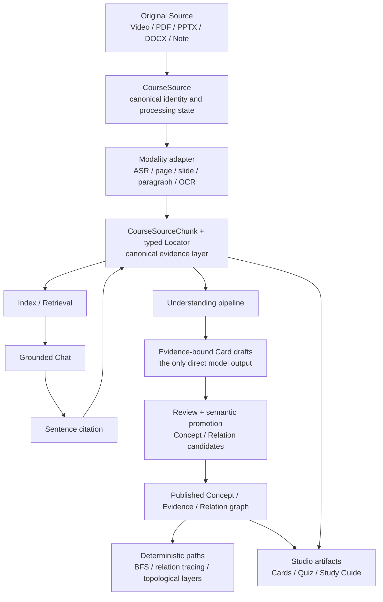

<h1 align="center">Video Course Cards</h1>

<p align="center">
  <strong>A local-first course notebook with source-grounded chat, timestamped learning artifacts, and reproducible research.</strong>
</p>

<p align="center">
  <a href="https://github.com/eatoften/Video_Course_Cards/releases/latest"><strong>Windows release</strong></a>
  &nbsp;|&nbsp;
  <a href="docs/roadmap.md"><strong>Product roadmap</strong></a>
  &nbsp;|&nbsp;
  <a href="docs/project-mastery-plan.md">Learning and mastery plan</a>
  &nbsp;|&nbsp;
  <a href="docs/learning/README.md">Technical notes</a>
  &nbsp;|&nbsp;
  <a href="docs/productization-log.md">Engineering log</a>
  &nbsp;|&nbsp;
  <a href="docs/Multimodal%20CNN%20ViT%20reader%20study.md">CNN vs ViT report</a>
  &nbsp;|&nbsp;
  <a href="docs/RAG%20retrieval%20and%20graph%20study.md">RAG report</a>
</p>

<p align="center">
  <a href="https://github.com/eatoften/Video_Course_Cards/releases/latest"></a>
  
  
  
  
  
</p>

Video Course Cards contains two connected components:

- a FastAPI, React, SQLite, and Tauri application that transcribes local course
  videos, unifies videos and documents as locatable Sources, persists
  source-scoped conversations, and produces local-model answers with
  server-owned sentence citation snapshots. It also supports course-level
  Notes with immutable Chat provenance and explicit Source publication,
  evidence-linked cards, Study documents, FSRS review, Course Map, and
  Markdown export;
- isolated research packages for controlled multimodal reading and RAG
  experiments, with versioned protocols, lecture-level splits, dataset hashes,
  sealed evaluation gates, and machine-readable results.

The active direction is a local-first, video-course-native information
understanding product. The research controller remains paused. The current
program builds an evidence-grounded Concept graph and deterministic
relationship/learning paths on top of the completed Sources -> Chat -> Notes
foundation before returning to Studio consolidation and product polish.

## Product status

Implemented:

- one canonical Source / Chunk / typed Locator contract for videos, transcripts,
  PDFs, PPTX, DOCX, Markdown, text, and imported audio/video;
- persistent multi-turn Chat with Source selection, bounded history,
  idempotent requests, explicit insufficient-evidence refusal, and durable
  sentence-level citation snapshots;
- one-click verifiable citations that return to a video timestamp, PDF page,
  slide, paragraph, or text section through a server-authoritative Source
  inspector, while preserving the saved quotation when a local file changes;
- course-level free Notes, idempotent capture of grounded Chat answers,
  immutable note-owned citation provenance, revision-safe editing, and
  deliberate publication of an exact note revision as a canonical Source;
- timestamped knowledge cards, versioned Study documents, FSRS Review, Course
  Map, graph exploration, and local Markdown export;
- recoverable SQLite schema migrations with validated pre-migration backups;
- immediate device and revisioned workspace drafts across the main editing
  surfaces, with honest save/conflict/leave-warning states;
- durable, bounded processing tasks with persisted progress, cooperative
  cancel, retry, idempotency, and restart recovery;
- recoverable Trash for the main workspace entities, plus validated full
  workspace backup/import/restore covering SQLite and managed local files.
- a G3 backend path engine over exact immutable GraphVersions: bounded Local
  BFS, deterministic shortest Relationship Trace, prerequisite closure and
  stable Kahn Learning Path, with evidence-bearing DTOs and result hashes;
- a G4 Studio Explore slice over the published Concept Graph: Overview, Local,
  Trace, and Learning views, relation rationale inspection, and server-owned
  evidence navigation back to the exact Source location;
- a G4 Draft Review workspace that edits complete evidence-bound Concept and
  Relation revisions, exposes Source locators during review, repairs stale
  endpoint bindings, records accept/reject decisions, previews the publication
  snapshot, and publishes a new immutable GraphVersion with compare-and-swap.

P0.4 reorganized the application around this product navigation:

```text
Sources
Chat
Studio
  -> Cards
  -> Notes
  -> Study
  -> Review
  -> Course map
  -> Explore
```

That checkpoint includes a typed canonical route contract, legacy-link
migration, one mixed Source catalog, full course Chat with conversation deep
links, the original five Studio tools, and cross-course request isolation.
P0.4 is complete on `main` but is **not part of the
published `v0.1.1` desktop release**.

P0.5 completes automatic preservation, recoverable and cancellable processing
tasks, safe deletion, validated backup/restore, and an owned desktop-backend
lifecycle. P1.1 closes the notebook capture loop: a grounded Chat answer can
be saved once as an editable Note without losing its immutable citations, and
an explicit publish action turns an exact revision into the stable Source
`note:<note_id>`. Note Sources participate in the same retrieval, citation,
Trash, reconciliation, and backup/restore contracts as imported material.

These checkpoints are now integrated into `main` but are **not yet a public
desktop release**. ADR-0008 places G0-G4 before P1.2: define a
canonical Concept/Evidence/Relation model, build one human-reviewed golden
course graph, implement deterministic traversal and prerequisite ordering, and
ship stable paths with per-edge evidence. Those G-stage capabilities are a
staged implementation program, not an end-to-end feature claim. G1.1 provides
a course-scoped, evidence-grounded store and API for human Concept and relation
candidates. G1.2a adds non-reusable Source projection generations, so a
reviewed evidence address cannot silently become current again after its text,
Locator, ordering, type, or chunker contract drifts and later reverts. G1.2b
adds append-only edit/review/stale revisions, normalized aliases, exact
Relation-to-Concept revision bindings, idempotent post-create operations,
historical reads, atomic incident-relation invalidation, and a transactional
prerequisite cycle guard. G1.2c adds append-only Concept merge/retirement,
dual-head compare-and-swap, replayable normalization receipts, redirect
chain/cycle prevention, and atomic invalidation of incident relations.
G1.2d makes initial Concept/relation creation operation-ID based, atomically
receipted, concurrency-safe, and replayable even after evidence or endpoint
drift. G1.3 now revalidates the complete reviewed draft and current Source
authority inside one serialized transaction, then seals a content-hashed,
self-contained GraphVersion behind active-version and draft-manifest CAS.
Historical versions remain auditable, while `/current` fails closed when its
Source authority drifts. G2.1 now implements the private human Concept
worksheet, redacted seal preparation, external OpenSSH key-control
attestation, immutable six-leaf Concept-stage publication, complete Relation
pair enumeration, and strict reload. It requires a reviewer public-key policy
whose exact bytes were committed before annotation. No real CS336 reviewer-key
policy has been registered, so no authorized worksheet or human label exists;
no `ConceptInventorySeal`, `GoldBundleSeal`, accuracy result, or path result
exists. The G2.2 prerequisite now centralizes exact-quote evidence resolution,
public annotation privacy checks, and four-stage detached attestations; no
Relation Pass A label or seal exists yet. G2.3 now implements the synthetic-
tested Pass A commit--reveal tooling: an exhaustive private worksheet,
G1-compatible evidence checks, a private immutable label artifact, and a
nonce-salted label-free hash commitment with independent Pass A namespace
signing. Public/private path capabilities are separated, and real-capability
integration tests replay canonical protocol/Source/Concept/Git/SSH authority,
revocation, no-overwrite publication, and seal-last recovery. There is
deliberately no reveal command before Pass B. This is software machinery, not
a real human Pass A result. G3 now implements the backend deterministic path
engine and exact-version APIs. G2.4's Git-derived 72-hour readiness tooling is
explicitly deferred while the product closes the visible graph loop. The first
G4 product slice now replaces the CardRelation Explore entry with a published
Concept Graph workspace and resolves Concept/Relation evidence through the
same hardened Source inspector used by Chat. Its Draft Review mode now closes
the Concept edit -> incident Relation invalidation -> current-endpoint rebind
-> evidence review -> CAS publication loop. Automatic Understanding, real
Relation gold, graph-aware Chat, an Obsidian-style overview, durable browser
E2E, public-course path evaluation, and performance acceptance remain roadmap
work. See the
[active roadmap](docs/roadmap.md),
[graph decision record](docs/decisions/ADR-0008-evidence-grounded-concept-graph-and-deterministic-paths.md),
[staged-human-gold decision](docs/decisions/ADR-0010-staged-human-gold-and-key-control-attestation.md),
[Pass A commit--reveal decision](docs/decisions/ADR-0011-embargo-relation-pass-a-behind-a-neutral-commitment.md),
[G1 substrate contract](docs/modules/concept-graph-substrate.md),
[Source projection generation contract](docs/modules/source-projection-generation.md),
[immutable graph publication contract](docs/modules/concept-graph-publication.md),
[G2.1 human annotation workflow](docs/modules/golden-graph-human-annotation-workflow.md),
[shared annotation security primitives](docs/modules/golden-graph-annotation-security-primitives.md),
[Relation Pass A workflow](docs/modules/golden-graph-relation-pass-a-workflow.md),
[G3 deterministic path engine](docs/modules/concept-graph-path-engine.md),
[G3 maintainer handoff](docs/learning/g3-deterministic-path-engine-handoff.md),
[G4 evidence workspace](docs/modules/concept-graph-evidence-workspace.md),
[G4 maintainer handoff](docs/learning/g4-evidence-path-workspace-handoff.md),
[learning and mastery plan](docs/project-mastery-plan.md), and
[append-only engineering log](docs/productization-log.md) for scope,
tradeoffs, tests, and known limitations.

Evaluation is also staged rather than retrofitted after implementation. The
[public-course benchmark contract](docs/evaluation/public-course-benchmark.md)
registers hash-pinned CS336 Spring 2025 slides, isolated authoring/development/
sealed partitions, a fail-closed acquisition boundary, and a separate CC0
counterfactual trust fixture. The
[G0.2 executable protocol boundary](docs/modules/golden-graph-evaluation-protocol.md)
now provides strict canonical artifacts, dependency and Source-slice binding,
registered claim rules, and no-overwrite freeze authority. The
[G0.2b Source-slice builder](docs/modules/golden-graph-source-slice-builder.md)
adds bounded PDF projection, exact verified-code execution, production-compatible
Source/Locator identities, redacted derivation leaves, and a reloadable ignored
private materialization. The CS336 Lecture 3 whole 68-page Source slice and
protocol are frozen and independently replayed, but they report **no accuracy
result**. G2.1 has implemented the Concept sealing machinery, including a
prior-commit reviewer-key trust root, but the maintainer must register the real
policy and author the human labels. Later Relation gold must be independently
sealed before path results.

The evaluation contract keeps four downstream authorities separate: the
protocol definition plus Source-slice freeze, a partition-bound
`GoldBundleSeal`, an automatic-proposal/Chat run family (`RunSpecSeal` plus
sealed `PredictionBundle`/`ResultBundle`), and an append-only access ledger.
The acquisition `ManifestAuthority` is their upstream prerequisite, not a
fifth downstream authority. The two currently registered sealed-transfer
lectures are below the five-cluster minimum, so G0.2a currently registers only
a diagnostic claim boundary; a future run-bundle runner must enforce actual
eligibility, and a confirmatory metric requires a new pre-registered protocol
with at least five independent sealed lecture clusters.

## Target architecture: one evidence backbone, two consumers

> **Partially implemented target architecture, not an end-to-end feature
> claim.** The Source-to-Chat path implements much of the evidence backbone,
> G1.1 persists grounded human Concept/relation candidates on that backbone,
> G1.2a versions their Source projections, G1.2b provides their reviewable
> draft lifecycle, and G1.2c gives Concept identities an auditable
> merge/retirement lifecycle. G1.2d adds durable initial-create receipts, and
> G1.3 publishes immutable authoritative GraphVersions with fail-closed Source
> authority. G2.1 supplies a separate evaluation-only human Concept handoff,
> but no real reviewer-key policy or authorized worksheet exists yet. G3
> supplies deterministic backend Local, Trace, and Learning queries over one
> exact active/current GraphVersion. The first G4 UI slice consumes those APIs,
> and its server-owned Graph Evidence resolver returns to the canonical Source
> or degrades to the immutable snapshot after Source drift. The current
> automatic Card pipeline still reads video `TranscriptChunk` objects directly,
> and no model candidate is an accepted graph fact.

Every imported material enters through a modality-specific adapter and is
normalized into the canonical `CourseSource` / `CourseSourceChunk` / typed
`Locator` contract. Chat and Understanding are sibling consumers of that
evidence layer: Chat retrieves original evidence directly, while Understanding
produces only evidence-bound Card drafts. A separate promotion boundary may
normalize reviewed Cards into Concept/Relation candidates; Cards remain
learning outputs rather than graph truth, and no candidate is published as
knowledge without Source evidence and explicit review.



The architecture preserves three different responsibilities:

| Layer | Authority | Responsibility |
| --- | --- | --- |
| Evidence | original Source plus revision-bound Chunk and Locator projections | preserve searchable text and a deterministic route back to the material |
| Semantics | reviewed Concepts, Claims, Relations, and their evidence links | represent stable meaning and justified structure without replacing the Source |
| Learning products | Cards, quizzes, guides, maps, and paths | present evidence and semantics for a learning task; remain regenerable artifacts |

The implementation migration is additive. These are architecture migration
steps, not aliases for the G1--G4 roadmap stage numbers:

1. Introduce separate Concept, ConceptEvidence, Relation, and
   RelationEvidence storage without renaming or deleting current Cards.
2. Make Understanding consume canonical `CourseSourceChunk` inputs across
   modalities and emit only evidence-bound Card drafts with
   revision/hash/Locator provenance. A separate review/promotion service maps
   reviewed Cards and original Chunks to Concept/Relation candidates. The
   legacy video Card path remains available until compatibility and backfill
   checks pass.
3. G3 builds deterministic traversal over accepted, current graph versions;
   model output may propose candidates but cannot decide path correctness.
4. G4 replaces the CardRelation-only discovery experience with stable Concept
   paths and per-edge evidence navigation, then measures quality and migration
   completeness before retiring legacy behavior.

This boundary is the architecture invariant for subsequent work:

```text
modality-specific extraction -> canonical evidence chunks
canonical evidence chunks    -> direct retrieval and grounded Chat
canonical evidence chunks    -> model-assisted Card drafts
reviewed Cards + Chunks      -> semantic candidates
grounded + validated review  -> published Concept graph
Concept graph + evidence     -> paths and learning artifacts
```

See [ADR-0008](docs/decisions/ADR-0008-evidence-grounded-concept-graph-and-deterministic-paths.md)
and the [graph annotation protocol](docs/graph-annotation-protocol.md) for the
identity, evidence, review, validity, versioning, and transaction contracts.

## Results

| Experiment | Data | Main result | Status |
| --- | --- | --- | --- |
| CNN-CTC vs ViT-CTC | 1,402 line crops from five CS231n lectures | CNN CER `0.1150`; ViT CER `0.4461` on the sealed lecture | Controlled, test opened once |
| OCR to card cascade | 16 reconstructed slide pages, 48 Qwen generations | Usable-card conversion: RapidOCR `0.6875`, CNN `0.3750`, ViT `0.0000` | Exploratory |
| Retrieval baselines | 118 cards, 40 development questions | Dense MiniLM leads BM25, RRF, and graph variants on MRR and nDCG@5 | Exploratory, candidate labels |
| Graph expansion | Eight development multi-hop questions | Joint Recall@3 rises `0.750 -> 0.875`, while single-card nDCG@5 falls by `0.163` | Exploratory, candidate graph |

## Experiment 1: CNN vs ViT Slide-Line Recognition

### Protocol

The benchmark contains 1,402 text-line crops from five independent CS231n
lectures:

| Split | Lectures | Lines | Use |
| --- | --- | ---: | --- |
| Train | Lectures 1-3 | 1,159 | Model fitting |
| Validation | Lecture 4 | 67 | Checkpoint selection |
| Test | Lecture 5 | 176 | Sealed evaluation, opened once |

The comparison controls the following variables:

- identical real and synthetic training data;
- identical character tokenizer and CTC decoding contract;
- identical line-height normalization and augmentation policy;
- identical shared trainer, evaluator, optimizer policy, and validation-based
  checkpoint selection;
- approximately matched parameter counts;
- the same 32-line exact-overfit gate before full training.

The CNN uses convolutional residual blocks followed by a shared CTC projection
head. The ViT uses handwritten patch embedding, positional embeddings, and
Transformer encoder blocks with the same CTC head.

### Sealed test result

| Reader | Parameters | CER down | WER down | Exact lines up | Median CPU ms/line down |
| --- | ---: | ---: | ---: | ---: | ---: |
| CNN-CTC v2 | 120,629 | **0.1150** | **0.3155** | **73 / 176** | 4.414 |
| ViT-CTC v1 | 111,253 | 0.4461 | 0.9442 | 5 / 176 | **0.687** |
| RapidOCR stored text | not measured | **0.0071** | **0.0408** | **158 / 176** | not measured |

The paired CNN-minus-ViT CER difference is `-0.3311`, with a 95% bootstrap
interval of `[-0.4126, -0.2551]`. All 5,000 bootstrap resamples favor the CNN.
Both models passed the same capacity check with `32/32` exact lines and zero
CER before the formal experiment.

### Interpretation

The result supports a small-data conclusion: under the recorded lecture-level
split and matched training setup, the convolutional inductive bias generalizes
better than the scratch ViT. It does not establish that CNNs are universally
better slide readers. The ViT is substantially faster per line but fails to
generalize from the available data.

RapidOCR is a practical pretrained reference, not a matched architecture
comparison. Its stored predictions use already accepted detector polygons, so
page-level detection recall and detector latency are excluded.

Code and records:

- models: `backend/multimodal_lab/models/cnn_ctc.py` and
  `backend/multimodal_lab/models/vit_ctc.py`;
- shared training: `backend/multimodal_lab/training/`;
- [full study](docs/Multimodal%20CNN%20ViT%20reader%20study.md);
- [frozen protocol and results](docs/experiments/assignment_5_protocol_results.json).

## Experiment 2: OCR Error Propagation Into Generated Cards

The three OCR outputs were reconstructed into the same 16 slide pages. Each
page was passed to `qwen3:4b` with the same prompt, temperature zero, model
digest, and output validator. Gold concepts were not included in the prompt.

| OCR source | Successful generations | Concept recall up | Grounded claim precision up | Citation correctness up | Usable-card conversion up |
| --- | ---: | ---: | ---: | ---: | ---: |
| CNN-CTC v2 | 14 / 16 | **0.7500** | 0.8667 | 0.6250 | 0.3750 |
| ViT-CTC v1 | **16 / 16** | 0.4375 | 0.4375 | 0.0000 | 0.0000 |
| RapidOCR stored text | 12 / 16 | **0.7500** | **0.9167** | **0.9231** | **0.6875** |

The ViT condition is the clearest failure case: every page produced a
schema-valid output, but no output met the usable-card criterion. Parsing
success is therefore a poor proxy for knowledge quality. Recognition errors in
technical terms, formulas, grouping, arrows, and layout propagate into concept
omissions, unsupported claims, and incorrect citations.

This experiment is exploratory. It contains only 16 pages, was run after an
infrastructure revision, and uses one model-assisted source auditor. The sealed
claim applies to the reader comparison, not to these downstream rates.

## Experiment 3: Card-Level Retrieval Baselines

### Corpus and protocol

The RAG corpus is a frozen snapshot of:

- 118 cards;
- 140 claims;
- 150 timestamped evidence spans;
- 100 candidate questions covering factual, conceptual, comparison,
  multi-hop, and unanswerable cases.

The current results use the 40-question development split. The 60-question test
split is blocked until all questions, gold cards, claims, evidence spans, and
graph decisions receive independent human review.

Dense retrieval uses `sentence-transformers/all-MiniLM-L6-v2`. All methods use
the same corpus and top-k evaluation. Graph variants start from the same Dense
anchors and perform one-hop expansion.

### Development result

| Retriever | Recall@1 up | Recall@5 up | MRR up | nDCG@5 up | Multi-hop joint R@3 up | Median ms down |
| --- | ---: | ---: | ---: | ---: | ---: | ---: |
| BM25 | 0.406 | 0.859 | 0.737 | 0.746 | 0.375 | **0.80** |
| Dense MiniLM | 0.594 | **1.000** | **0.901** | **0.924** | 0.750 | 24.19 |
| BM25 + Dense RRF | **0.609** | 0.969 | 0.891 | 0.898 | 0.500 | 25.30 |
| Dense + noisy graph | 0.562 | **1.000** | 0.875 | 0.904 | 0.750 | 24.97 |
| Dense + candidate graph | 0.422 | **1.000** | 0.805 | 0.852 | **0.875** | 24.57 |

Dense retrieval is the strongest current direct-question baseline. Compared
with BM25, it improves Recall@5 by `0.141`, MRR by `0.164`, nDCG@5 by `0.178`,
and multi-hop joint Recall@3 by `0.375`, at roughly 23 ms additional median
latency.

RRF does not improve over Dense on this development set. Candidate graph
expansion improves multi-hop joint Recall@3 by `0.125`, but reduces overall
nDCG@5 by `0.072` and single-card nDCG@5 by `0.163`. The bootstrap intervals
are `[0.000, 0.375]`, `[-0.133, -0.016]`, and `[-0.255, -0.077]`, respectively.
The graph therefore introduces a measurable coverage-ranking tradeoff rather
than a general retrieval improvement.

Unanswerable false-retrieval rates are `0.125` for BM25, `0.000` for Dense,
`0.375` for RRF, and `0.000` for both graph variants under the recorded scoring
policy.

## Experiment 4: Grounded Generation And Graph Ablation

Dense and Dense-plus-candidate-graph retrieval were passed to the same
`qwen3:4b` model with identical top-5 context size, 6,000-character budget,
prompt, temperature, and confidence gate.

| System | Claim citation recall up | Citation precision up | Abstention F1 up | Reference cosine proxy up | Median generation ms down |
| --- | ---: | ---: | ---: | ---: | ---: |
| Dense | 0.8125 | 0.8125 | **0.9841** | 0.8547 | 6,883.9 |
| Dense + candidate graph | **0.8333** | **0.8163** | **0.9841** | **0.8566** | **6,864.1** |

Graph expansion changes the top-5 set for 9 of 40 questions and changes eight
generated answers. It produces one gold-claim citation-recall win, 39 ties, no
losses, and no multi-hop answer gain. The overall citation-recall difference is
`0.0156` with a bootstrap interval of `[0.0000, 0.0469]`.

The reference-answer cosine value is only a semantic proxy and is not reported
as answer correctness. Independent correctness and entailment review remains
unfinished.

Prompt-only abstention failed on all eight unsupported development questions.
A pre-generation Dense-confidence gate correctly refused all eight, with one
shared false abstention on an answerable question, producing `0.9841`
development F1. This threshold is development-calibrated and is not a test
result.

## Graph Diagnostic

The candidate relation graph was also measured independently from QA:

| Measurement | Result |
| --- | ---: |
| Candidate edges | 20 |
| Covered cards | 32 / 118, 27.1% |
| Isolated cards | 86 |
| Largest connected component | 4 cards |
| Candidate-edge mean cosine | 0.515 |
| Lecture-matched random non-edge mean cosine | 0.267 |
| Edges with an endpoint outside Dense top-5 | 9 / 20, 45.0% |

The graph is too sparse to support a large-scale knowledge-memory claim. The
current result only motivates a later scale experiment: typed relations may be
more useful for exploration, prerequisite paths, and curriculum organization
than for unconditional direct-QA expansion.

See [Graph as an Associative Knowledge Structure](docs/Graph%20as%20associative%20knowledge%20structure.md)
for the null baseline, proposed scale study, and falsification conditions.

## Implementation

```text
video
-> ffprobe validation
-> FFmpeg audio extraction
-> faster-whisper timestamped transcript
-> Sentence Transformer semantic chunks
-> local Qwen grounded generation
-> SQLite
-> Course Map / Study / FSRS Review / Retrieve / Graph / Markdown export
```

| Area | Implementation |
| --- | --- |
| HTTP and orchestration | FastAPI, Pydantic service and store layers |
| Media pipeline | ffprobe, FFmpeg, faster-whisper |
| Local models | Ollama/Qwen and Sentence Transformers |
| Persistence | SQLite with migrations and explicit CRUD stores |
| Frontend | React, TypeScript, Vite |
| Desktop packaging | Tauri with a packaged FastAPI sidecar |
| Research models | PyTorch CNN-CTC and ViT-CTC |
| Evaluation | pytest, frozen JSON protocols, hashes, bootstrap intervals |

Research code is kept outside the product package:

```text
backend/app              product APIs and SQLite workflows
backend/multimodal_lab   OCR data, models, training, and sealed evaluation
backend/rag_lab          corpus snapshots, retrievers, generation, and metrics
docs/experiments         compact versioned protocols and results
```

## Installation

Download the packaged Windows application from the
[latest release](https://github.com/eatoften/Video_Course_Cards/releases/latest).
The current release is `v0.1.1`.

The installer does not bundle model weights. Install Ollama and pull the
default generation model:

```powershell
ollama pull qwen3:4b
```

FFmpeg, Ollama/Qwen, and the configured Sentence Transformer must be available
for their corresponding features. See [local model setup](docs/local-llm.md)
and [desktop packaging](docs/tauri-desktop.md).

Current desktop constraints:

- Windows is the only packaged target exercised;
- the installer is not code-signed;
- local model installation remains user-managed;
- Markdown export is a snapshot and does not synchronize back into SQLite.

## Developer Setup

Requirements: Python 3.11, [uv](https://docs.astral.sh/uv/), Node.js 22,
FFmpeg, and Ollama.

Start the backend:

```powershell
cd backend
$env:PYTHONUTF8='1'
$env:PYTHONDONTWRITEBYTECODE='1'
uv sync
uv run python -B -m uvicorn app.main:app --host 127.0.0.1 --port 8001 --reload
```

Start the frontend in a second terminal:

```powershell
cd frontend
npm.cmd install
npm.cmd run dev
```

Open `http://127.0.0.1:5174`. FastAPI documentation is available at
`http://127.0.0.1:8001/docs`.

## Reproducing The Experiments

Run the complete backend suite:

```powershell
cd backend
uv run pytest
```

To exercise the real public-course product path, acquire the exact registered
CS336 Lecture 3 PDF and seed a new isolated local workspace:

```powershell
cd backend
uv run --frozen python -m benchmark_acquisition.fetch `
  --manifest benchmark_acquisition/manifests/cs336-sp25-v1.json `
  --asset-id lecture-03-architecture
uv run --frozen python -m product_demo `
  --workspace data/product_demos/cs336-l3-attention-local
```

The command uses the production PDF importer, Source/Chunk store, Concept
review/publication services, path engine, and citation resolver. It refuses a
non-empty workspace and verifies the registered file hash before parsing. Its
three Concepts and two relations are an automated engineering fixture, not
human gold and not an accuracy result; the PDF and generated workspace remain
gitignored.

The latest complete backend regression, at the G3 checkpoint, passed `1125`
tests with `7` skipped. The G4-focused path/publication/citation regression
passes `36` tests with `1` skipped, and all `212` frontend tests pass. Python
bytecode compilation, frontend ESLint, the TypeScript/Vite production build,
`git diff --check`, and the production-dependency high-severity npm audit also
pass. After removing the unreachable legacy force graph, the production build
has no oversized-chunk warning; the main JavaScript chunk is approximately
`376.48 kB` after minification.

The P1.1 acceptance journey was also exercised in a real browser at desktop
and narrow widths: create Note -> publish Source -> index -> ask grounded Chat
question -> open the citation -> save the answer as a Note -> delete and Undo
or restore it from Recovery. Both viewports completed without horizontal
overflow or console errors.

The G4 product slice was exercised in a clean real browser over the hash-pinned
CS336 Lecture 3 PDF: Sources exposed 68 page Chunks; Explore returned the
two-hop `Full Attention -> Sparse Attention -> Sliding-window Attention` Trace;
each relation opened its evidence on PDF page 65 or 66; and Learning returned
the three expected layers. The browser console had no warnings or errors. This
is an automated-fixture/manual-browser engineering acceptance record, not
human gold, an accuracy result, or a durable E2E suite.

The Draft Review continuation was exercised against a fresh copy of that
workspace: edit Full Attention at revision 2 -> accept revision 4 -> repair the
stale prerequisite against endpoint revisions `(4, 2)` -> accept relation
revision 5 -> publish GraphVersion v2. The published graph retained the same
two-hop Trace, three Learning layers, and page-65 Source evidence. This remains
a manual engineering acceptance over an imported fixture, not human gold.

| Experiment | Main entry point | Record |
| --- | --- | --- |
| CNN/ViT training | `backend/multimodal_lab/run_train_reader.py` | `backend/multimodal_lab/configs/reader_cnn_v2.json`, `reader_vit_v1.json` |
| Sealed reader comparison | `backend/multimodal_lab/run_reader_comparison.py` | [Assignment 5 result](docs/experiments/assignment_5_protocol_results.json) |
| OCR-to-card cascade | `backend/multimodal_lab/run_reader_card_cascade.py` | [CNN/ViT report](docs/Multimodal%20CNN%20ViT%20reader%20study.md) |
| Retrieval baselines | `backend/rag_lab/run_retrieval_experiment.py` | [R2 result](docs/experiments/rag_r2_development_results.json) |
| Grounded generation | `backend/rag_lab/run_grounded_answer_experiment.py` | [R3/R4 result](docs/experiments/rag_r3_r4_development_results.json) |
| Graph audit | `backend/rag_lab/run_graph_organization_audit.py` | [Graph result](docs/experiments/rag_graph_organization_audit_v1.json) |
| Adaptive controller smoke runner | `backend/rag_lab/run_controller_experiment.py` | [Smoke artifact](docs/experiments/rag_controller_smoke_v1.json) |

Videos, extracted frames, line crops, full prediction logs, embeddings, and
checkpoints remain under ignored `backend/data/` paths. Git tracks code,
protocols, hashes, compact results, and validity notes. Exact OCR numbers cannot
be reproduced without recreating the non-redistributable lecture inputs that
match the recorded hashes.

The Lecture 5 OCR test is closed to further tuning. The RAG test runner remains
blocked until candidate benchmark and graph annotations are independently
reviewed and sealed.

## Limitations

- The controlled OCR result covers one sealed lecture from one course and slide
  family.
- RapidOCR is evaluated on accepted line polygons, not full-page detection.
- The card cascade contains 16 pages and one model-assisted source auditor.
- The RAG tables are development results over candidate annotations.
- Only eight development questions test multi-hop retrieval.
- The 20-edge graph covers 27.1% of cards and is not a large-scale graph result.
- The visual research pipeline is not yet integrated into the desktop product.

## Next Experiments

1. Independently review and seal the RAG benchmark before opening its test set.
2. Add a new held-out lecture and a second auditor for the multimodal cascade.
3. Evaluate Dense, typed traversal, and query-conditioned graph routing over
   larger frozen card-corpus snapshots under equal latency and context budgets.

## License

No open-source license has been declared. Source availability does not grant
permission to redistribute or reuse the code.
