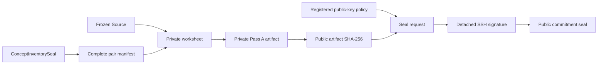

# G2 Relation Pass A 学习交接

## 这一阶段到底做了什么

它没有替你标注 CS336，也没有生成 golden graph。它解决的是一个更基础但
很关键的问题：如何让你第一次标注的关系在第二次标注前保持不可见，同时又
不能在看完第二次结果后偷偷改写第一次结果。

核心答案是 commit--reveal：

```text
你填写的私有 worksheet（含原文 quote）
-> 加入只保留在私有侧的 256-bit 随机 nonce
-> 私有、不可变、去原文的 Pass A artifact
-> 只公开 artifact hash 的中性 request
-> 你在程序外用 SSH key 签名
-> 公开 commitment seal
-> commit + push
-> 等 72 小时并完成 Pass B
-> 才能原字节 reveal Pass A
```

## 你需要闭卷画出的数据流



你要能解释每一条边：Source 负责证据真实性；Concept seal 固定端点；pair
manifest 防止只挑“看起来有关系”的 pair；hash 防止 Pass B 后换答案；签名只
证明某个已登记 key 批准了精确 request。

## 三个最容易说错的点

### 1. “Pass A seal 就是关系金标准”——错

Pass A 还没有经过 delayed Pass B 和 disagreement adjudication。它既不是
`R_gold`，也不能解锁 graph/path accuracy。它只是“第一次完整判断已经承诺且
不能静默替换”。

### 2. “签名证明是我本人独立完成”——错

SSHSIG 只能证明注册 key 的控制权。程序不能证明持钥者是人、没有看模型输出、
确实等待了 72 小时，或者判断在语义上正确。因此 artifact 明确保留：

```text
software_authenticated_reviewer_identity = false
software_authenticated_prediction_blindness = false
software_authenticated_minimum_delay = false
```

### 3. “把 Pass A 放在私有目录就够了”——错

如果没有事先公开 hash，你可以在完成 Pass B 后删除旧 A、重写一个更一致的 A
再签名。公开中性 commitment 既不泄漏标签，又让这种替换被 hash 检出。
随机 nonce 还解决了另一个细节：关系标签空间有限，如果直接 hash 确定性的标签
文件，别人可以离线枚举候选答案；salted commitment 同时提供 binding 和 hiding。

## 这次加固里最值得学的三个软件工程点

1. **能力类型要表达可见性。** 公共验证只接收
   `RelationPassAPublicCommitmentPaths`，这个类型里根本没有私有 artifact path；
   完整本地重放才接收包含 private/public 两部分的 stage paths。
2. **检查后不能继续读取调用者对象。** Python 的 frozen dataclass 仍可被
   `object.__setattr__` 恶意改写。发布前先深度 reparse 成本地 snapshot，后续只
   发布 snapshot，避免 validation 和 write 之间的 TOCTOU。
3. **多文件事务要定义失败语义。** 四个目标先做路径去重和全量 preflight，
   然后按 private artifact、request、attestation、seal 的顺序写；最后的 seal
   才是 root，所以中途崩溃只留下可重试 orphan，不留下假 authority。

还有一个常见误区：已经拿到一次 loader receipt，不代表以后永远可以只信内存。
Relation 的 authority-changing transition 会重新读取 frozen protocol、private
Source materialization、Concept 六叶 DAG 和 Git 历史 policy；内存对象只是“可供
重新验证的收据”，不是永久可信的数据库快照。

## Relation 数据模型

每个 unordered pair 必须完整回答一次：

```text
pending                       # 只能出现在 draft
none + none_rationale         # 明确负例
relations + 1..5 judgments    # 明确正例集合
```

五种关系：

| 类型 | 方向 |
| --- | --- |
| `prerequisite` | A -> B 表示先理解 A 再学 B |
| `part_of` | A -> B 表示 A 是 B 的组成部分 |
| `example_of` | A -> B 表示 A 是 B 的例子 |
| `related` | 对称，端点只存一次 |
| `contrast_with` | 对称，端点只存一次 |

同一个 pair 可以有多种具体关系，但同一种 type 只能出现一次。`related` 是兜底
关系，不能和更具体的关系并存。全部 `prerequisite` 必须组成 DAG。

## 为什么 inference evidence 必须复用 Concept evidence

G1 的生产关系存储不是“有两个 quote 就算支持”。对于
`pedagogical_inference`：

- `source_endpoint` 必须精确匹配 source Concept 当前 revision 的证据；
- `target_endpoint` 必须精确匹配 target Concept 当前 revision 的证据。

这样才不会出现“端点 Concept 由证据 X 定义，但关系推理却偷偷用另一个没有审核
过的证据 Y”的情况。Pass A 在 prepare 和 deep reload 时都检查一次。

`source_asserted` 则只允许 `relation_assertion`，因为此时 Source 本身直接陈述了
关系。

## 你应该读的代码顺序

1. `relation_annotation_models.py`：先看 pair outcome、evidence role、cycle。
2. `relation_pass_a_workflow.py`：看 prepare、sign、publish、reload 状态机。
3. `annotation_evidence.py`：理解 quote 如何变成 UTF-8 span/hash。
4. `annotation_attestation.py`：理解 namespace 和 registered policy。
5. `annotation_artifacts.py`：理解 no-overwrite、sidecar、seal-last。
6. `relation_annotation_command.py`：看 CLI 如何只做 orchestration 和安全 receipt。
7. 对应测试：从正常路径读到 tamper/privacy/capability 边界。

## 面试时可以怎么讲

一个合格的简短版本：

> 我把人工关系标注设计成 delayed two-pass protocol。Pass A 标签保留在
> gitignored immutable artifact 中，只把 canonical hash、上游 lineage 和
> detached SSH attestation 公开；这样 Pass B 看不到 A，但 A 也不能事后改写。
> 每个 pair 都来自 sealed Concept inventory 的完整二次组合，关系证据复用统一
> Source span contract，inference endpoint 必须匹配 Concept evidence，且
> prerequisite 在 seal 前做全图 DAG 校验。签名只作为 key-control evidence，
> 不夸大成人类身份或盲法证明。

## 你的动手任务

真实标注前先做一个小修改，任选一个：

1. 新增测试：对称关系端点反序必须失败；
2. 新增测试：`none` 同时携带 relation 必须失败；
3. 新增测试：public commitment loader 即使 private A 文件不存在仍能验证；
4. 给 CLI 的一个静态错误类别补测试，确认不泄漏私有路径。

完成后，你需要向自己回答：这个测试保护的是 schema、lineage、privacy、
cryptography 还是 semantic truth？最后一种不能由单元测试替代。
