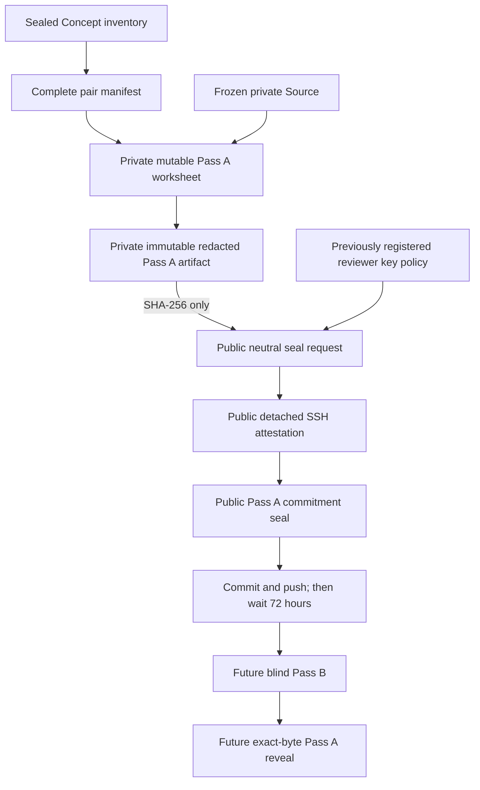

# Golden Graph Relation Pass A Workflow

## Module status

- **Software boundary:** implemented on the active graph branch
- **Semantic authority:** not created
- **Current real CS336 labels:** zero
- **Current GoldBundle / agreement / accuracy / path result:** none
- **Next authority:** a Git-registered reviewer-key policy, then a
  maintainer-authored Concept seal and real maintainer-authored Pass A
  worksheet/commitment

This module implements a commit--reveal boundary for the first exhaustive
Relation pass. Tests use synthetic labels only. The application does not fill,
suggest, review, or approve the real CS336 worksheet.

## Ownership

This module owns:

- initialization of one empty row for every pair in the sealed pair manifest;
- strict `none` versus typed/directed Relation judgments;
- Relation evidence-role and Concept-evidence compatibility;
- complete-pass prerequisite DAG validation;
- private redacted label materialization;
- a tracked, label-free Pass A hash commitment;
- Pass A namespace signing, seal-last publication, and deep replay;
- a public commitment loader whose path type cannot name the private label
  artifact;
- canonical upstream Concept/Git-policy replay and pre-publication signed
  snapshots that do not continue reading caller-owned object graphs.

It does not own:

- Concept discovery or normalization;
- automatic Understanding proposals;
- Pass B, elapsed-delay authority, disagreement, or adjudication;
- reveal of Pass A labels;
- final graph import, paths, model evaluation, or product UI;
- proof that the reviewer is human, blind, or semantically correct.

## Why the stage is split



If A labels were tracked immediately, B would not be blind. If every A byte
remained private and mutable, A could be replaced after seeing B. The public
commitment binds the hidden bytes without revealing them.

## Artifact contract

| Artifact | Boundary | Contains labels? | Mutable? | Authority |
| --- | --- | ---: | ---: | --- |
| `RelationPassAWorksheet` | ignored `backend/data/` | yes, including exact quotes | yes, before prepare | none |
| `RelationPassAArtifact` | ignored `backend/data/` | yes, redacted spans only | no | hidden Pass A content bound by hash |
| `RelationPassASealRequest` | tracked artifact tree | no | no | exact neutral signing challenge |
| `DetachedKeyAttestationArtifact` | tracked artifact tree | no | no | registered-key control only |
| `RelationPassASeal` | tracked artifact tree, published last | no | no | Pass A commitment only, not gold |

The private worksheet and artifact also carry one random 256-bit
`commitment_nonce_hex`. The public request carries only the salted worksheet
and artifact hashes, never the nonce. This matters because the Relation label
space is finite: a bare deterministic hash would bind labels but could allow
offline guessing of low-entropy candidates.

Private and public destinations are different types:

```text
RelationPassAPrivatePaths(artifact)
RelationPassAPublicCommitmentPaths(request, attestation, seal)
RelationPassAStagePaths(private, public)
```

The public loader accepts only the public type. Pass B initialization can
therefore be tested without handing it an object that contains the hidden A
artifact path.

The public request, seal, CLI receipts, and error boundary omit positive and
negative counts, Relation types, directions, endpoint keys, evidence, and
rationale. `pair_count` is already public in the Concept-stage pair manifest.

Immutable fields describe historical facts:

```text
labels_embargoed_at_commitment = true
labels_unreleased_at_commitment = true
label_release_policy = after_relation_pass_b_seal
```

They do not pretend to be a mutable release-status database.

## Data and authority flow

```text
load historical Concept policy
-> reload canonical frozen-protocol JSON/sidecar and ignored private Source
   materialization/sidecar from disk
-> deeply load Concept six-leaf DAG from repository-derived paths
-> consume the fresh replay rather than the caller-owned capability

load active Relation policy
-> require Pass A namespace and current Git registration

sealed Concepts + private Source + active Relation policy
-> initialize exhaustive pending worksheet
-> HUMAN completes every pair and reviewer declarations
-> canonical worksheet parse
-> aggregate public-prose privacy scan
-> exact-quote resolution to EvidenceSpan
-> G1 support-role validation
-> inferred endpoint span membership against sealed Concept evidence
-> global prerequisite-cycle validation
-> private immutable Pass A artifact
-> public hash-only seal request
-> external OpenSSH signature
-> deep-reparse a detached signed publication snapshot
-> replay signature, private evidence, privacy, and lineage before any write
-> require four pairwise-distinct destinations
-> preflight every private/public leaf
-> publish private artifact, request, attestation, seal last
-> reload public commitment and private artifact from disk
-> issue local sealed authority
```

The Concept policy and Relation policy commits are separate inputs. Usually a
new real workflow will use one pre-registered four-namespace policy for both.
Keeping the inputs separate also lets an older Concept-only seal remain
historically verifiable while a later active policy authorizes Pass A.

## Schema and semantic invariants

### Exhaustive packet

- 12--20 sealed Concepts produce exactly 66--190 unordered pairs.
- Worksheet pair rows equal `RelationPairManifest.pairs` item-for-item and in
  manifest order.
- A draft row is `pending`; a complete worksheet contains no pending row.
- A completed row is exactly `none` plus a rationale, or `relations` plus one
  or more judgments.
- The target 20--35 final edges is not a schema gate and cannot justify an
  unsupported edge.

### Relation identity and direction

- directed: `prerequisite`, `part_of`, `example_of`;
- symmetric: `related`, `contrast_with`;
- every judgment uses exactly the two Concepts in its pair;
- self-loops are invalid;
- symmetric source/target keys use lexical canonical order;
- one pair contains at most one judgment of each Relation type;
- generic `related` cannot coexist with a more specific Relation;
- the complete Pass A prerequisite subgraph must be acyclic.

Pass A decisions are not marked `accepted/current`: they have not been through
Pass B and adjudication and are not `R_gold`.

### Evidence compatibility with G1

The module consumes the shared G2 evidence resolver and then enforces the
existing G1 Relation contract:

| Support basis | Exact allowed role set | Additional gate |
| --- | --- | --- |
| `source_asserted` | `relation_assertion` only | span must replay against frozen Source |
| `pedagogical_inference` | `source_endpoint` and `target_endpoint` only | each span must equal evidence on the corresponding sealed Concept |

On deep reload, every span is replayed and endpoint membership is checked
again. Source-bearing quotes never enter the redacted artifact.

A future importer must handle one subtle mapping rule: symmetric Relations are
canonicalized here by stable Concept key, while G1 canonicalizes runtime
Concept IDs. If key-to-ID mapping reverses endpoint order, the importer must
also swap `source_endpoint` and `target_endpoint` roles.

## CLI

The adapter is `golden_graph.relation_annotation_command`.

```powershell
uv run --directory backend python -m golden_graph.relation_annotation_command init-relation-pass-a --concept-reviewer-key-policy-commit <CONCEPT_POLICY_COMMIT> --relation-reviewer-key-policy-commit <ACTIVE_RELATION_POLICY_COMMIT>

uv run --directory backend python -m golden_graph.relation_annotation_command prepare-relation-pass-a-seal --concept-reviewer-key-policy-commit <CONCEPT_POLICY_COMMIT> --relation-reviewer-key-policy-commit <ACTIVE_RELATION_POLICY_COMMIT>

uv run --directory backend python -m golden_graph.relation_annotation_command seal-relation-pass-a --concept-reviewer-key-policy-commit <CONCEPT_POLICY_COMMIT> --relation-reviewer-key-policy-commit <ACTIVE_RELATION_POLICY_COMMIT> --signature <DETACHED_SIGNATURE_FILE>

uv run --directory backend python -m golden_graph.relation_annotation_command verify-relation-pass-a-commitment --concept-reviewer-key-policy-commit <CONCEPT_POLICY_COMMIT> --relation-reviewer-key-policy-commit <RELATION_POLICY_COMMIT>

uv run --directory backend python -m golden_graph.relation_annotation_command verify-relation-pass-a --concept-reviewer-key-policy-commit <CONCEPT_POLICY_COMMIT> --relation-reviewer-key-policy-commit <RELATION_POLICY_COMMIT>
```

Global `--protocol`, `--materialization`, `--worksheet`, and
`--repository-root` overrides must appear before the subcommand.

The commitment-only verification command does not open the private Pass A
artifact. Full local verification does. Neither command prints labels.

There is no reveal command in this stage.

## Failure and recovery behavior

- initialization never overwrites a worksheet;
- preparation canonicalizes and freezes the private artifact/request;
- changing any semantic worksheet value after preparation makes sealing fail;
- signing revalidates the active policy before and after cryptographic work;
- publication snapshots canonical signed bytes before validation, so a caller
  mutation after the validation hook cannot change bytes being published;
- all private/public leaves are preflighted before the first publication;
- CLI preparation batch-preflights both private candidate leaves before either
  is written;
- the public seal is published last;
- identical retries repair compatible JSON/sidecar crash remnants;
- conflicting retries never overwrite existing bytes;
- the full loader verifies private labels against the neutral public hash;
- the public loader verifies request, attestation, seal, upstream hashes, and
  historical policy without reading labels;
- CLI errors are mapped to static classes and do not echo private paths,
  quotes, or validation inputs.

## Technology choices

| Technology | Use in this module | Interview point |
| --- | --- | --- |
| Pydantic v2 strict/frozen models | closed schemas and conditional invariants | schema validation is not semantic truth |
| Canonical UTF-8 JSON + SHA-256 + private nonce | stable, salted artifact identity and commit--reveal | nonce-backed commitments bind bytes and resist finite-label guessing |
| OpenSSH SSHSIG / Ed25519 | detached registered-key approval | proves key control, not humanity |
| Git history | prior policy registration and future commitment ordering | repository governance is part of the trust model |
| immutable sidecar publication | no-overwrite and crash recovery | seal-last makes partial DAGs non-authoritative |
| exact Source-span replay | citation currentness and privacy | source-first evidence survives derived-model changes |
| Kahn topological validation | reject prerequisite cycles | deterministic graph invariant before path generation |

## Verification matrix

Focused synthetic tests cover:

- blank exhaustive 66-pair initialization;
- complete positive/negative partition and redacted quote resolution;
- public request/seal/receipt label-leak scans;
- exact support-role sets and sealed Concept-evidence membership;
- pair reordering, duplicate type/direction conflict, and prerequisite cycles;
- external Pass A namespace signing and deep replay;
- public commitment loading while the private artifact loader is disabled;
- gitignored/untracked private artifact enforcement;
- mutable worksheet drift after commitment preparation;
- separate historical Concept and active Relation policies;
- parser duplicate-key and token-gated authority boundaries.

Real-capability integration tests additionally construct a typed Source
materialization, canonical frozen protocol file, Git-registered historical
Concept policy, six-leaf signed Concept DAG, active Relation policy, and real
OpenSSH signatures. They cover policy revocation versus historical replay,
canonical path substitution, nested protocol/policy mutation, cross-namespace
signature reuse, public/private path separation, signed-object mutation after
validation, all-leaf preflight, no-overwrite conflicts, seal-last crash retry,
persisted-byte tampering, and static CLI errors without private details.

Passing tests establish a software protocol only. The real CS336 worksheet
still requires the maintainer to read the original Source, decide every
Concept and pair, inspect the public diff, protect the private artifact, and
commit/push the neutral seal before starting Pass B's delay.

## Maintainer learning checkpoint

Before beginning real Pass A, the maintainer should be able to explain and
draw:

1. why early label publication and fully private mutable labels are both
   invalid;
2. which artifact contains quotes, labels, hashes, and signatures;
3. why `source_asserted` and `pedagogical_inference` need different evidence;
4. why a signature is not proof of human review;
5. why a Pass A seal is not `R_gold`;
6. how symmetric endpoint canonicalization affects evidence-role import;
7. where a crash may leave partial files and why seal-last remains safe.

The maintainer-owned coding exercise for this stage is to add one synthetic
invalid-case test or fix one worksheet/CLI validation bug without changing the
frozen protocol or hash-bound annotation guide.
